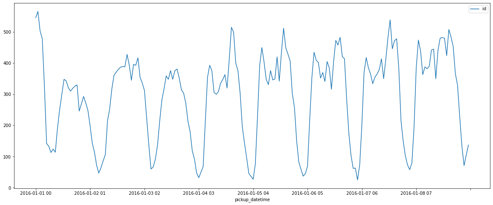
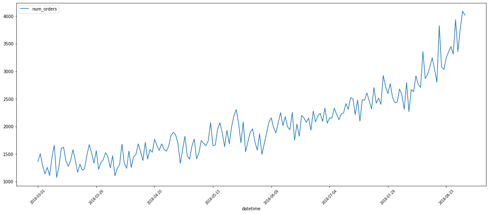
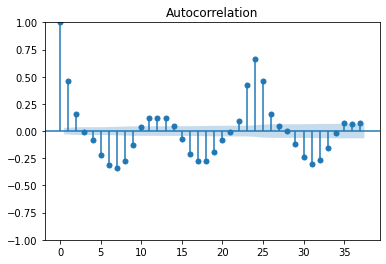
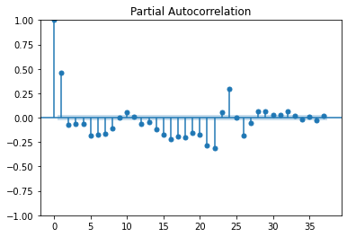
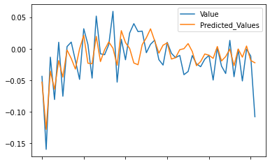
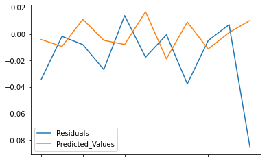
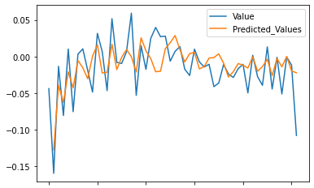
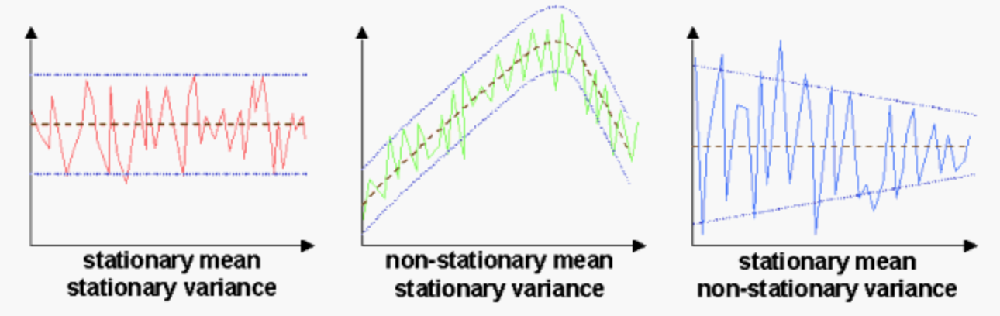
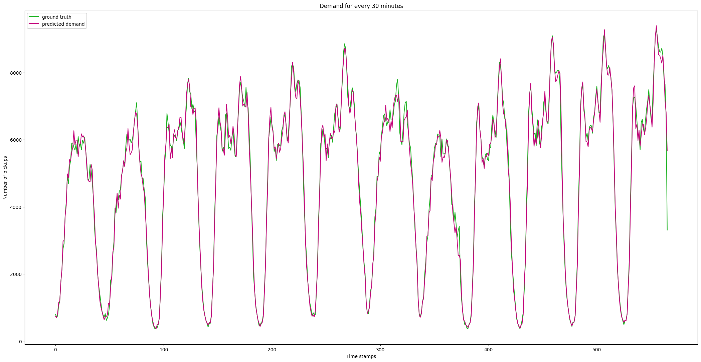

# Taxi Demand Prediction

Forecasting is ubiquitous. In addition to strategic forecasts, such as those predicting revenue, production, and spending, organizations across industries need accurate short-term, tactical forecasts, such as the number of goods to be ordered and the number of employees needed, to keep pace with their growth
  
With this, we expect to formulate an efficient method to predict the demand for taxis over time 
  

## Now what makes forecasting a challenge? 
There are a lot of constraints to forecasting in this case that would be as diverse behaviour and interests, physical constraints, and unpredictability which might also include geographic distance and road throughput move forecasting from the temporal to Spatiotemporal domains.
  
But looking at sample data which is yellow taxi trip data in NYC over 6 months we can notice some seasonality (weekly and monthly) there are a few peaks because of the sheer number of major holidays scattered throughout the year.
 

  

 
There is a particular dip in the demand towards the start this is particularly interesting because on the day this happened snowfall was at its peak so this clearly states that we have to take weather data into account.
  
If we zoom in and switch to hourly data for July 2016, you will notice both daily and weekly (7X24). You may notice that weekends tend to be busier.
 

  

## Data and other miscellaneous stuff

The data was provided but I find it very underwhelming for this kind of task with such sheer complexity.
 

  

And with a lot of external factors affecting it so the data used was from - (https://www.nyc.gov/site/tlc/about/data.page) which is the official site of NYC gov.  
With this weather data was also used which was again downloaded from the official gov website.
  
Computing the loss throughout the project was done by RMSE or MSE which is also used by a lot of time series models. 
 

## Prominent forecasting approaches
Apart from qualitative methods, quantitative forecasting approaches can be grouped as follows: model-based or causal classical, statistical methods, and machine-learning approaches.
  
When the underlying mechanisms are not known or are too complicated, e.g., the stock market, or not fully known, e.g., retail sales, it is usually better to apply a simple statistical model. Popular classical methods that belong to this category include ARIMA (autoregressive integrated moving average), exponential smoothing methods, such as Holt-Winters, and the Theta method, which is less widely used but performs very well.

### Linear Regression 
There's enough documentation in the notebook itself [here](https://github.com/jatinakad/05_Zum_TAXI-DEMAND-PREDICTION-USING-TIME-SERIES/blob/main/TAXI_DEMAND_PREDICTION_USING_TIME_SERIES.ipynb)

### ARIMA

One of the statistical models used here is ARIMA which again stands for autoregressive integrated moving average which is linear regression combined with moving average to make the model more robust.
 
The degree of which can be obtained by looking at autocorrelation and partial autocorrelation plots -   
| Auto Correlation | Partial Auto Correlation | 
| ---------------- | ------------------------ |
|||
 
- ARIMA makes use of lagged moving averages to smooth time series data. 
- Autoregressive models implicitly assume that the future will resemble the past.
 
Here the results of AR and MA models are because as we say <i> Keep It Simple, Stupid </i> - 
  

| Auto Regression | Moving Average | Combined ARMA |
| ---------------- | ------------------------ | --------------- |
||| |

 
But of course, this has to come with its shortcomings which include data assumptions which ARIMA models always assume that the data is stationary.

#### what is Stationarity?
this simply means that the model assumes that the data was a constant mean with a constant standard deviation throughout the data and has no seasonality but as we just saw with the figure our data does have some kind of seasonality so the data is not very stationary the exact number comes out to be <b> 12.3453e-13 </b>. which is acceptable by the standards so we went ahead and gave it a shot.   

  
### Spatial Temporal Graph Neural Networks 

The data we have is mainly time-varying as supposed to be spatially varying and such information requires a graph and Neural Network which are developed to deal with time-varying features of a graph and can be considered as Spatio-Temporal graph neural nets.
 
 
The model was trained on ADAM optimizer and the loss was calculated with MSEloss for 200 epochs other than that all the major/minor detail is explained throughout the file [TempAttention](./TempAttention/).
  
Here's the result for the model -  

 

### Final Conclutions 
Finally, the model needs a lot of improvement and again concatenating the spatial-temporal data with weather data can be very 

